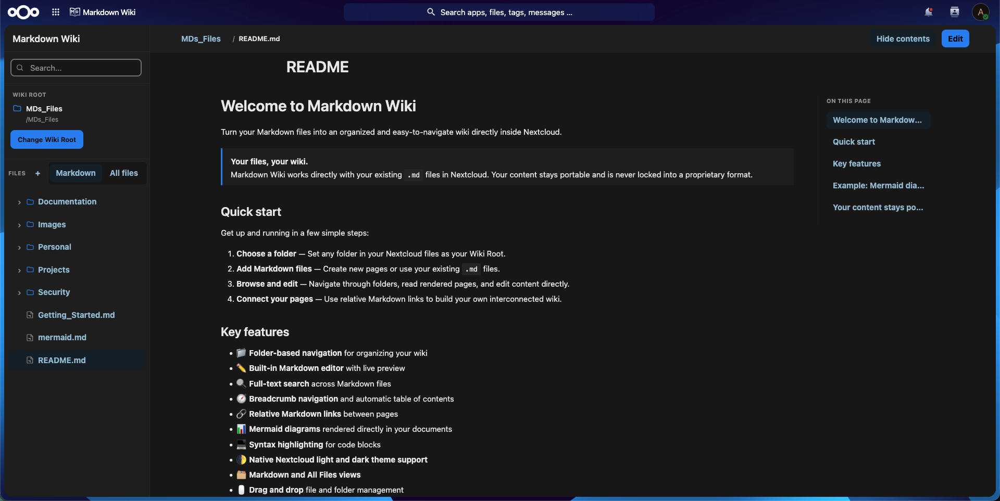
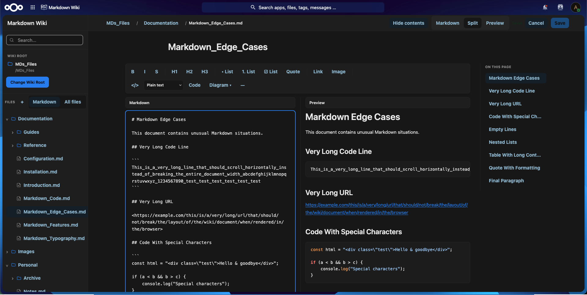
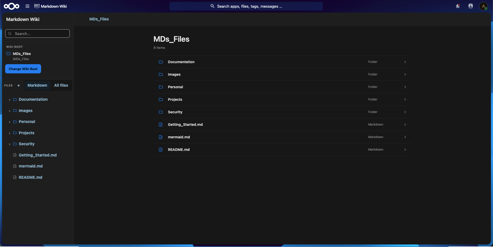
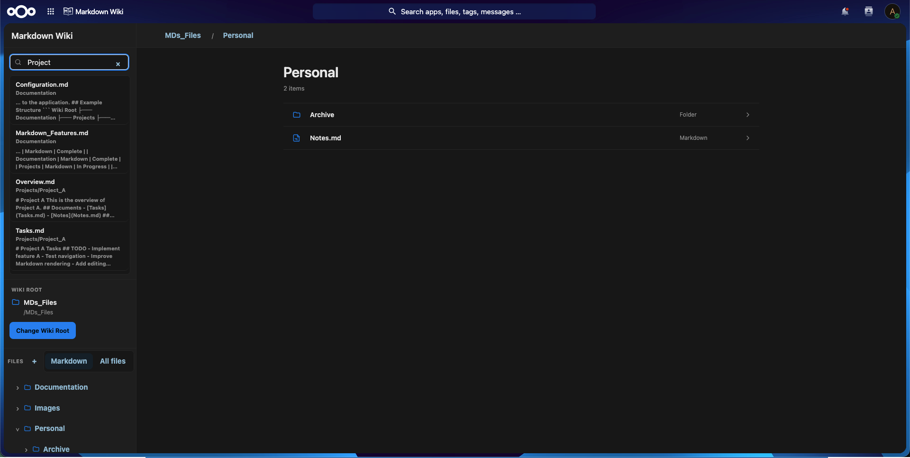
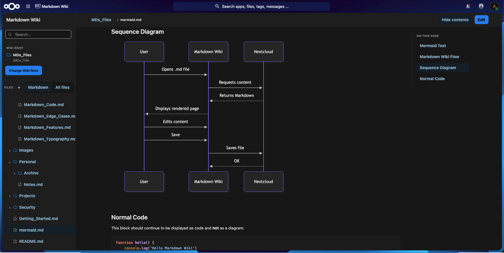
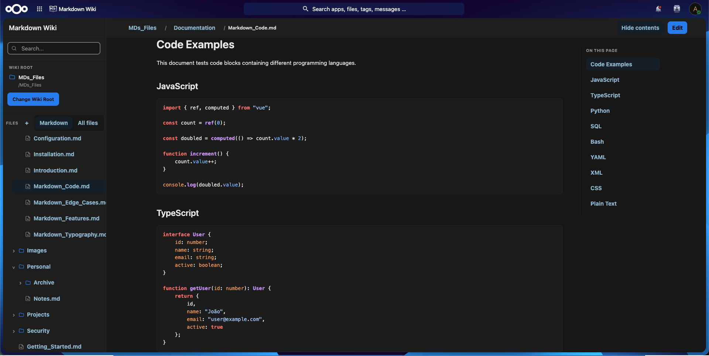

# Markdown Wiki

Markdown Wiki is a Nextcloud application that turns your Markdown files into an organized and easy-to-navigate wiki directly inside Nextcloud.

Your content remains stored as standard Markdown files, keeping it portable and accessible without locking it into a proprietary format.



## Features

- **Folder-based navigation** — Browse your wiki through a familiar folder tree.
- **Built-in Markdown editor** — Read, edit, and preview Markdown without leaving Nextcloud.
- **Full-text search** — Quickly find content across your Markdown files.
- **Breadcrumb navigation** — Easily navigate through your wiki structure.
- **Previous and next navigation** — Move between Markdown pages without returning to the file tree.
- **Automatic table of contents** — Navigate headings within long documents.
- **Internal Markdown links** — Follow relative links between Markdown pages directly inside the app.
- **Mermaid diagrams** — Render flowcharts, sequence diagrams, and other Mermaid diagrams.
- **Syntax highlighting** — Display code blocks with language-aware highlighting.
- **File management** — Create, rename, move, and delete files and folders.
- **Drag and drop** — Organize files and folders using drag-and-drop.
- **Markdown and All Files views** — Focus on Markdown files or browse all files in your Wiki Root.
- **Markdown checklists** — Render Markdown task lists and checkboxes.
- **Light and dark themes** — Integrates with your Nextcloud theme.

## Screenshots

### Editor



### File manager



### Full-text search



### Mermaid diagrams



### Code highlighting



## How it works

Choose a folder in your Nextcloud files as your **Wiki Root**. Markdown Wiki uses the folder structure to build your navigation tree and renders the Markdown files inside it as wiki pages.

The underlying files remain regular `.md` files in Nextcloud, so they can still be accessed, synchronized, downloaded, and edited outside Markdown Wiki.

## Requirements

- Nextcloud 31–34

## Installation

### Nextcloud App Store

Markdown Wiki can be installed directly from the Nextcloud App Store.

1. Open **Apps** in your Nextcloud instance.
2. Search for **Markdown Wiki**.
3. Install and enable the app.
4. Open Markdown Wiki and choose a folder as your **Wiki Root**.

### Manual installation

Download a release of Markdown Wiki and extract it into your Nextcloud `apps` or `custom_apps` directory so that the application is located at:

```text
apps/markdown_wiki
```

Then enable the application from the Nextcloud Apps page or with:

```bash
php occ app:enable markdown_wiki
```

## Development

Clone the repository and install the JavaScript dependencies:

```bash
npm install
```

Build the frontend:

```bash
npm run build
```

For development with Vite:

```bash
npm run dev
```

## Compatibility

Markdown Wiki currently supports:

| Nextcloud | Supported |
| --- | --- |
| 31 | Yes |
| 32 | Yes |
| 33 | Yes |
| 34 | Yes |

## Reporting issues

Found a bug or have a feature request? Please open an issue in the GitHub issue tracker.

## License

Markdown Wiki is licensed under the GNU Affero General Public License v3.0 or later (`AGPL-3.0-or-later`).

See [`LICENSES/AGPL-3.0-or-later.txt`](LICENSES/AGPL-3.0-or-later.txt) for the full license text.